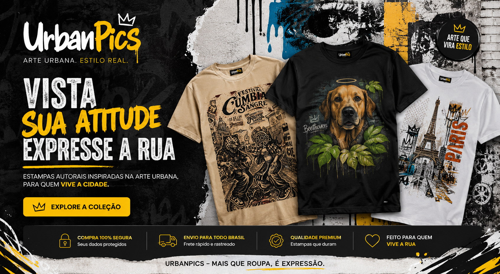

# UrbanPics
Every Wall Has a Story
# 🎨 UrbanPics

> **Every wall tells a story. Every journey becomes wearable art.**



---

# About

UrbanPics is an independent Print-on-Demand fashion project that transforms photographs taken during real journeys into exclusive wearable artwork.

Instead of creating generic AI images, UrbanPics starts with authentic photographs captured around the world:

- Street Art
- Murals
- Urban Architecture
- Cultural Symbols
- Religious Heritage
- Hidden Corners of Cities

Each image is artistically reinterpreted into premium apparel designs.

---

# Philosophy

UrbanPics believes that cities are open-air museums.

Every mural...

Every abandoned wall...

Every forgotten artwork...

Every travel memory...

can become timeless wearable art.

---

# Design Process

```
Travel

↓

Photography

↓

Selection

↓

Creative Direction

↓

AI Enhancement

↓

Digital Illustration

↓

Print-ready Artwork

↓

Print-on-Demand

↓

Worldwide Delivery
```

---

# Collections

## 🎭 Urban Saints

Modern reinterpretations of sacred figures inspired by urban culture.

Examples

- Saint Michael Street Edition
- Cyber Saint George
- Neon Madonna
- Sacred Graffiti

---

## 🐕 Street Dogs

Murals celebrating forgotten city guardians.

Example

- Beethoven

---

## 🌍 Europe Walls

Street art discovered during journeys across Europe.

Countries

- Spain
- Slovakia
- France
- Portugal
- Italy

---

## 🎨 Murals Project

Transformation of public murals into artistic fashion.

Each design starts from an original photograph.

---

## 🏛 Travel Memories

Photographs transformed into artistic illustrations.

Examples

- Eiffel Tower
- Madrid
- Bratislava
- Lisbon

---

# Technology

UrbanPics combines creativity and AI.

Tools

- ChatGPT
- Midjourney
- Photoshop
- Illustrator
- Canva
- Printful
- Shopify

---

# Business Model

```
Photography

↓

Digital Art

↓

Collections

↓

Shopify

↓

Print-on-Demand

↓

Global Customers
```

No inventory.

No mass production.

Small artistic collections.

Limited Drops.

---

# Roadmap

## Phase 1

- Brand Identity
- Shopify Store
- First Collection
- GitHub Repository

## Phase 2

- 100 Designs
- International Shipping
- Instagram
- Pinterest

## Phase 3

- Artist Collaborations
- Limited Editions
- Premium Collections

---

# Inspiration

UrbanPics is inspired by

- Street Art
- World Travels
- Architecture
- Religious Iconography
- Cultural Heritage
- Urban Photography

---

# Mission

Transform real travel memories into timeless wearable art.

---

# Author

**Absalão Silva**

AI Consultant

Creative Director

Urban Photography

Brazil 🇧🇷 | Spain 🇪🇸

---

# Future

✔ Shopify

✔ Printful

✔ Instagram

✔ Pinterest

✔ Etsy

✔ Amazon Merch

---

> "The world is already an art gallery. We simply help people wear it."
