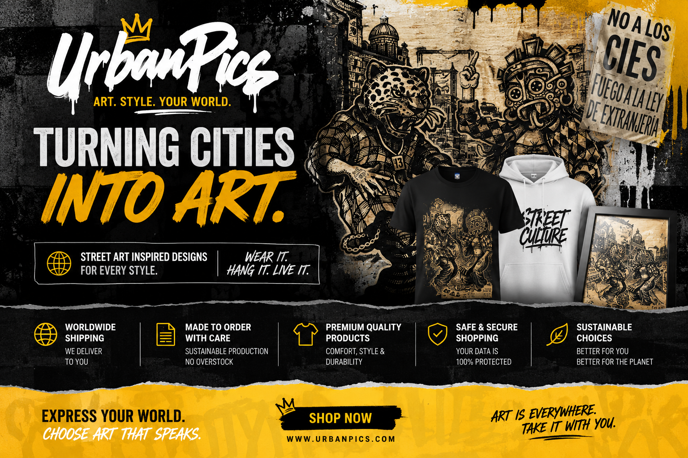
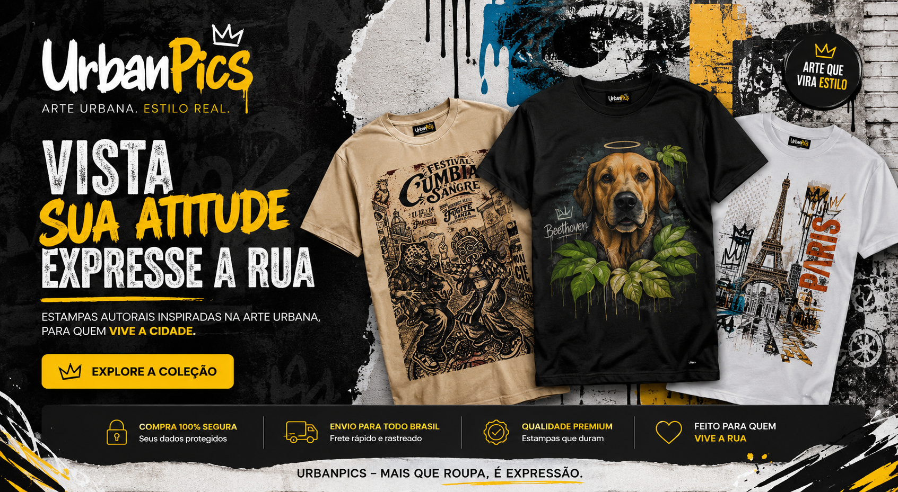

Caramelo 
# UrbanPics
Every Wall Has a Story
# 🎨 UrbanPics

> **Every wall tells a story. Every journey becomes wearable art.**


---

# About

UrbanPics is an independent Print-on-Demand fashion project that transforms photographs taken during real journeys into exclusive wearable artwork.

Instead of creating generic AI images, UrbanPics starts with authentic photographs captured around the world:

- Street Art
- Murals
- Urban Architecture
- Cultural Symbols
- Religious Heritage
- Hidden Corners of Cities

Each image is artistically reinterpreted into premium apparel designs.

---

# Philosophy

UrbanPics believes that cities are open-air museums.

Every mural...

Every abandoned wall...

Every forgotten artwork...

Every travel memory...

can become timeless wearable art.

---

# Design Process

```
Travel

↓

Photography

↓

Selection

↓

Creative Direction

↓

AI Enhancement

↓

Digital Illustration

↓

Print-ready Artwork

↓

Print-on-Demand

↓

Worldwide Delivery
```

---

# Collections

## 🎭 Urban Saints

Modern reinterpretations of sacred figures inspired by urban culture.

Examples

- Saint Michael Street Edition
- Cyber Saint George
- Neon Madonna
- Sacred Graffiti

---

## 🐕 Street Dogs

Murals celebrating forgotten city guardians.

Example

- Beethoven

---

## 🌍 Europe Walls

Street art discovered during journeys across Europe.

Countries

- Spain
- Slovakia
- France
- Portugal
- Italy

---
## Others
- Futurist images
- Free imagination
---
## 🎨 Murals Project

Transformation of public murals into artistic fashion.

Each design starts from an original photograph.

---

## 🏛 Travel Memories

Photographs transformed into artistic illustrations.

Examples

- Eiffel Tower
- Madrid
- Bratislava
- Lisbon

---

# Technology

UrbanPics combines creativity and AI.

Tools

- ChatGPT
- Midjourney
- Photoshop
- Illustrator
- Canva
- Printful
- Shopify

---

# Business Model

```
Photography

↓

Digital Art

↓

Collections

↓

Shopify

↓

Print-on-Demand

↓

Global Customers
```

No inventory.

No mass production.

Small artistic collections.

Limited Drops.

---

# Roadmap

## Phase 1

- Brand Identity
- Shopify Store
- First Collection
- GitHub Repository

## Phase 2

- 100 Designs
- International Shipping
- Instagram
- Pinterest

## Phase 3

- Artist Collaborations
- Limited Editions
- Premium Collections

---

# Inspiration

UrbanPics is inspired by

- Street Art
- World Travels
- Architecture
- Religious Iconography
- Cultural Heritage
- Urban Photography

---

# Mission

Transform real travel memories into timeless wearable art.

---

# Author

**Absalão Silva**

AI Consultant

Creative Director

Urban Photography

Brazil 🇧🇷 | Spain 🇪🇸

---

# Future

✔ Shopify

✔ Printful

✔ Instagram

✔ Pinterest

✔ Etsy

✔ Amazon Merch

✔ Gelato 

---

> "The world is already an art gallery. We simply help people wear it."



**1. Desconstrução do Problema**
Objetivo final:

Viver de uma marca autoral de moda que explora arte urbana e religiosa com apelo estético e simbólico, via print on demand.

Componentes mínimos:
Fonte de conteúdo: 
Fotografias de murais e cenas urbanas.
Transformação artística: Conversão dessas fotos em arte com estilo.
Plataforma de venda: 
Loja POD (Printful, Printify, Colab55, etc.).
Público-alvo segmentado: 
Espiritualizados, urbanos alternativos, fashionistas, religiosos descolados.
Distribuição & marketing: 
Instagram, TikTok, Pinterest, Blog, Marketplaces.
**2. Identifique os 20% que geram 80% dos resultados**
O que mais importa agora:
Prova de conceito visual (portfólio com 5 a 10 artes impactantes).
Definição de categorias + narrativa por coleção.
Testar vendas com tráfego orgânico ou pequeno tráfego pago.
**Ações de maior alavancagem:**
Criar uma coleção mínima com 3 nichos:
Murais urbanos transformados (ex: arte de rua do mundo);
Ícones religiosos remixados (Oxum neon, São Jorge cyberpunk...);
Coleção afetiva de viagem (memórias visuais com toque artístico).
Lançar com mockups realistas e vídeos curtos mostrando o "antes e depois" da arte (engaja e vende).
Usar Instagram Reels + Pinterest como canais principais.
Criar uma landing page com testes de interesse (pré-venda) para validar.
**3. Crie um framework original**
Framework: URBEART POD

Uniqueness – Use imagens reais e exclusivas, transformadas.
Resignificação – Religiosidade, cultura e identidade convertidas em moda.
Batch & Drop – Produção em lotes digitais por coleção temática.
Engajamento – Storytelling por trás de cada arte + bastidores criativos.
ART – Arte que se veste. Arte que conta histórias. Arte que circula.

**4. Sugestão de experimento (7 a 14 dias)**
Nome: MVP de Coleção Arte Urbana e Espiritualidade Remixada
Duração: 14 dias
Objetivo: Validar interesse e conversão para uma coleção com 3 temas.
Plano de ação:

Dia 1-3

Escolher 6 imagens fortes (próprias), transformar em arte printável.
Criar 3 coleções com identidade visual e nomes:
Ex: "Santos de Concreto", "Encantos do Asfalto", "Rituais Visuais".

Dia 4-6

Subir as estampas em uma loja POD (Shopify + Printful, ou Colab55).
Criar mockups e vídeos comparativos (foto original vs arte final).

Dia 7-10

Rodar uma campanha no Instagram e Pinterest (orgânica ou com R$50).
Criar uma bio-link com formulário de feedback + pré-venda.

Dia 11-14

Medir:
Cliques
Adições ao carrinho
Comentários / mensagens diretas
Pré-vendas ou intenções de compra
Modelo Mínimo Viável (MMV)
Elemento	Versão MMV
Produtos	6 estampas
Plataforma	Loja POD gratuita + Instagram
Estratégia de marketing	Reels comparativos e storytelling
Monetização	Pré-venda com botão de interesse
Validação	5 vendas ou 20 respostas positivas

| Etapa | Item | Status (✅/❌) | Data Concluída | Observações |
| ----- | ---- | ------------ | -------------- | ----------- |
✅ CHECKLIST DE EXECUÇÃO – PROJETO PRINT ON DEMAND AUTORAL
📸 1. COLETA CRIATIVA (CAPTURA & CURADORIA)
 Selecionar 5 fotos autorais com potencial visual (murais, cenas urbanas, religiosos, etc.)
 Criar pasta “Seleção Bruta”
 Criar pasta “Selecionadas p/ Estilo 1” (vetorial, colagem ou AI)
 Dar um nome provisório a cada imagem (ex: Anjo de Bratislava, Cyber-Mariachi)
🎨 2. TRANSFORMAÇÃO ARTÍSTICA
 Escolher o estilo visual principal (ex: vetorial bold, colagem digital, sketch+AI)
 Converter as 3 primeiras imagens em arte final (usar IA ou app gráfico)
 Exportar em alta (PNG transparente e mockup .JPG)
 Salvar versões com e sem assinatura digital
🧠 3. STORYTELLING & CONCEITO
 Criar 1 nome forte para a primeira coleção (ex: Divindades Urbanas)
 Escrever uma mini história para cada arte (máx. 300 caracteres)
 Definir 3 valores da marca (ex: autenticidade, cultura de rua, espiritualidade pop)
🛍️ 4. MONTAGEM DA LOJA / VITRINE
 Criar conta no Printful / Redbubble
 Integrar com loja gratuita ou página de vendas (Gumroad, Etsy, etc.)
 Subir os 3 primeiros produtos com mockups realistas
 Testar visual em camiseta, moletom e pôster
📢 5. LANÇAMENTO (DROP TESTE)
 Criar conta de Instagram com feed artístico (não “comercial”)
 Postar os 3 designs com storytelling e CTA (“qual seu favorito?”)
 Criar link de pré-venda por 72h com urgência (ex: “somente 20 unidades”)
 Compartilhar com 5 amigos influentes ou grupos nichados
📈 6. MÉTRICAS DE VALIDAÇÃO
 Acompanhar curtidas, comentários e salvamentos no Instagram
 Medir visitas na loja e cliques no produto
 Registrar se houve venda, pedido de info ou engajamento espontâneo
🧠 DICA DE AUTORRESPONSABILIZAÇÃO

Use a lógica de “se não fiz, é porque decidi não priorizar”. A cada item não checado, pergunte:
➡️ “O que está me travando? Como posso tornar esse passo mais simples?”
